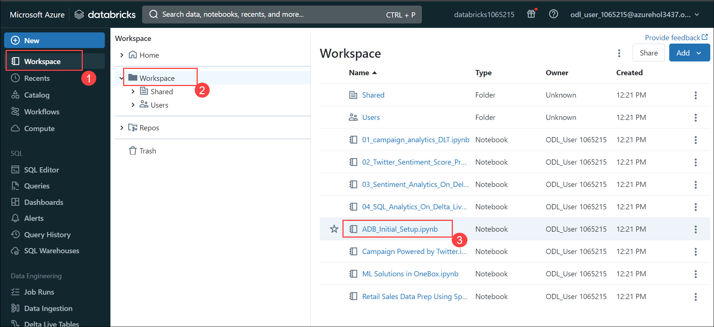
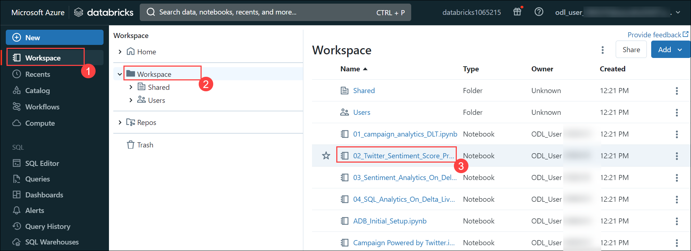
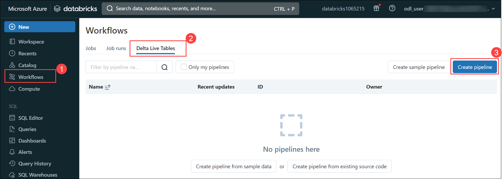
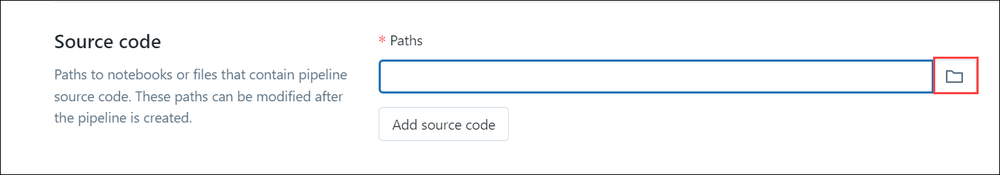

### Exercise 2: Explore the offline data and analytics pipeline using open Delta format and Azure Databricks Delta Live Tables. Stitch streaming and non-streaming data landed earlier to create a combined data product to build a simple Lakehouse. 

Analyzing disparate data sources in an integrated way has been a challenge for Wide World Importers. In the past, different teams at the company were assigned to analyze customer churn, social media trends, marketing campaigns, and sales forecasts. So, it was left to business analysts and executives to synthesize these datasets into a data-driven, decision-making solution. By delivering a Lakehouse, it becomes simpler for teams to collaborate in a unified workspace to process, analyze, and model data.

In this exercise, you will stitch two sets of data together to generate actionable insights. You will set up an Azure Databricks Delta Live Table (DLT) pipeline to build a simple Lakehouse. The pipeline will enrich the data by scoring it with machine learning models to help better understand customers and how to reduce churn.

The data source for the pipeline is the Bronze layer in ADLS Gen2, which was loaded by the Synapse pipeline in Exercise 1. This Bronze layer contains campaign data, customer churn data, store transactions data, sales data, and Twitter messages.

#### Task 2.1: Set up Azure Databricks environment 

In this task, you will set up the Azure Databricks environment.

1.	In the Azure portal web session (tab), in the search box (located across the top of the page), enter: **Azure Databricks**

2.	In the search results pane, select **Azure Databricks**.

    

3.	On the **Azure Databricks** page, select the resource that has a name starting with **databricks**.

   >**Note:** Each user has their own unique instance of this resource. Each Azure Databricks workspace is provisioned with a full-featured development environment.

4.	In the Azure Databricks resource page, select **Launch Workspace**.

    

    *A new web session (tab) will open. Now, set up the Databricks compute ready to serve your workload.*

    >**Note:** If a pop-up appears, select **Close**.

5. Select **Workspace (1)** from the left navigation pane, click on **Workspace (2)** folder and Select the **ADB_Initial_Setup (3)** notebook.
   
    
   
    > **Note: DO NOT** run this script. 
    > This image is for informational purposes only. 
    > Due to time constraints, we will not run this notebook in the lab session.

*In exercise 1, we extracted data from a spectrum of data sources and landed it into the ADLS Gen2 data lake. To access this data from the ADLS Gen2 data lake, we need to mount it on the Azure Databricks filesystem. Executing this script will mount ADLS Gen2 to Azure Databricks.*

---

#### Task 2.2: Review sentiment analysis model training. 

In this task, you will explore the sentiment analysis model training notebook. This notebook is used to retrieve the model ID that’s used by the DLT pipeline for further data processing.

*Sentiment Analysis is a branch of Natural Language Processing where text is contextually mined to identify and extract subjective information in the source material to understand whether the underlying sentiment is positive, negative, or neutral.*

1. To open a different workspace, select **Workspace (1)** from the left navigation pane, click on **Workspace (2)** folder and Select the **02_Twitter_Sentiment_Score_Pred_Custom_ML_Model (3)** notebook.

    

    > **Note: DO NOT** run this script.

    *Running this script will generate a ML model ID. This Model ID is used by the Delta Live Pipeline that we will create in the next task to perform ML operations on Twitter data.* 

---

#### Task 2.3: Create a Delta Live Table pipeline. 

In this task, you will create a Delta Live Table pipeline.

*Delta Live Tables (DLT) make it easy to build and manage reliable data pipelines that deliver high-quality data on Delta Lake. DLT helps data engineering teams simplify ETL development and management with declarative pipeline development, automatic data testing, and deep visibility for monitoring and recovery.*

1.	At the left, select the **Workflows (1)** icon, select the **Delta Live Tables (2)** tab and click on **Create Pipeline (3)**.

    

2.	In the **Create pipeline** window, in the **Pipeline name** box, enter a name like **Delta Live Table Pipeline**.

    

3.	To set the **Notebook libraries** property, select the notebook icon (at the right).

     

4.	In the **Select a notebook** window, select the **03_Sentiment_Analytics_On_Delta_Live_Tables** notebook.

   >**Note:** Due to time constraints, we will add only **03_Sentiment_Analytics_On_Delta_Live_Tables** notebook library to the pipeline in the lab session.

   
   
 
   >**Note**: (TO BE SKIPPED)
   >
   >Similarly, we can repeat steps 5 and 6 to add the other three notebook libraries. 
   >
   >* 01_campaign_analytics_DLT
  >  
  >* Campaign Powered by Twitter
  >
  >* Retail Sales Data Prep Using Spark DLT
   
5.	In the **Storage location** box, enter: **/mnt/delta-files/lakedb/**

6.	In the **Target schema** box, enter: **lakedb**

7. Select **Create**.

    

   *Once you select **Create**, it will create the Delta Live Table pipeline with all the notebook libraries added to the pipeline.*
 
   

   > **Note: DO NOT** select **Start**.

   *If you click on **Start**, Databricks will start executing the pipeline which will take approximately 10 minutes.*
 
   

   > **Note:** The following instructions are for informational purposes only. Due to time constraints, we will not start the pipeline in the lab session.

8. After approx 10 mins, this is the view you would have seen. **Observe** the data lineage of Bronze, Silver and variety of Gold tables.

    

    This pipeline is based on the medallion architecture, a simple yet powerful design pattern for organizing your Lakehouse.

**Bronze** data is usually raw, unprocessed data from source systems.

**Silver** data is created by cleaning and organizing raw data for further analysis and exploration.

**Gold** data is the finished analytical products – star schema tables for BI applications, engineered features for ML models, and shareable data assets for third parties, Data Mesh architectures, and other downstream consumers.

As you can see in this diagram, all the data is first landed in the Lakehouse. This is where it is further processed into different medallion layers, as discussed earlier.

The Twitter sentiment and campaigns data is stitched together to create a combined data product. This product is further consumed in the next exercise for machine learning and business intelligence use cases.

This information can then be piped into Microsoft Purview as a part of an overall view of your Azure data estate. The Lakehouse was designed around simplicity, openness, and collaboration. It is an extremely powerful architecture for addressing the many unique and interesting problems of a modern cloud data stack ready to be leveraged by Wide World Importers.

Congratulations! You have now setup a solid foundation of fully stitched data comprised of campaign data and Twitter data from disparate sources, including some key data transformations.

----
*Continue to page 5 ...*
