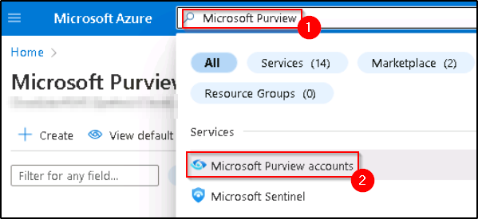
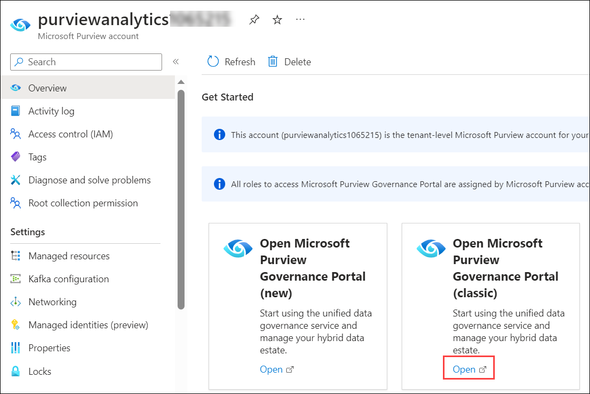
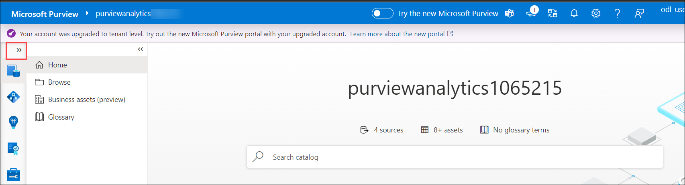
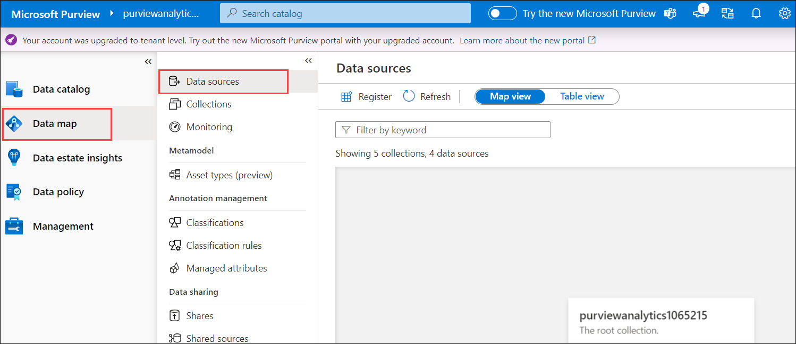
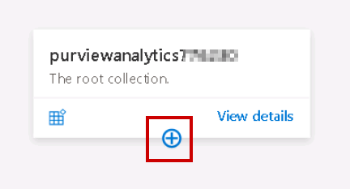
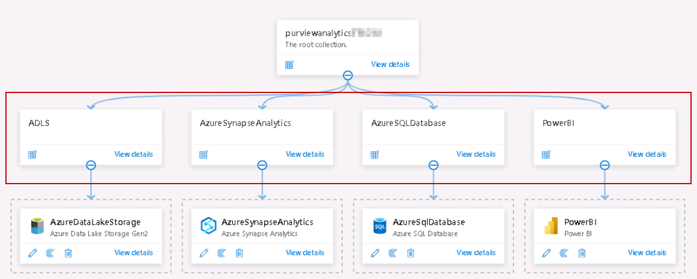

### Exercise 4: Glimpse of Purview to govern the overall data and analytics estate. 

In Exercise 1, you loaded raw data into the Lakehouse. Then, in Exercise 2, you used a Delta Live Table pipeline to transform it into a data product for downstream consumption by analysts. 

In Exercise 3, you applied machine learning operations on this data product to build a customer sentiment model. This sentiment analysis allows Wide World Importers to determine which hashtags are trending so they can customize their campaigns to improve their sales while retaining their existing customers.

Meanwhile, Microsoft Purview provides a unified data governance service that helps manage and govern Wide World Importers’ data, which is stored in multi-cloud environments and in data sources such as Oracle, Teradata, ADLS Gen2, and Azure SQL Database.

In this exercise, you will explore the Wide World Importers data estate that’s registered in Microsoft Purview.

1. In the Azure portal web session (tab), In the search results pane, select **Microsoft Purview accounts**.

    

2. In the **Microsoft Purview accounts** page, select the resource that has a name starting with **purviewanalytics**.

   >**Note:** Each user has their own unique instance of this resource.

   [Select the resource](../media/img403.png) 

4.	In the Microsoft Purview accounts resource page, in the **Open Microsoft Purview Governance Portal (classic)** tile, select the **Open** link.

       

    *Microsoft Purview Governance Portal opens in a new web session (tab).*

5.	In the Microsoft Purview Governance Portal web session (tab), at the top left expand the dashboard by clicking on the **>>**. 

    

6.	Select the **Data map** icon and then select **Data Sources**.

    *Data map makes your data meaningful by graphing your data assets and their relationships across your data estate. Use a data map to discover data and manage access to that data.*

    

7.  In the map view, for the root collection item, select the plus (+) icon to reveal the collections.

    

8.	Expand each of the collections to review specific sources related to those collections.

     

----

Congratulations! You as Data Engineers, have helped Wide World Importers gain actionable insights from its disparate data sources, thereby contributing to future growth, customer satisfaction, and competitive advantage.

In this lab, we experienced the creation of a simple, integrated, open and governed Data Lakehouse foundation using the Microsoft Analytics Solution Pattern. 

In this lab, we covered the following: 
1.	First, we looked at data ingestion from a spectrum of analytical and operational data sources into the Lakehouse. We started with streaming data and analytics pipeline using ADX for a near real-time analytics scenario, followed by Synapse pipelines that ingested raw data from analytical/operational data sources to the Bronze layer. 

2.	Second, we explored offline data and analytics pipelines using open Delta format and Azure Databricks Delta Live Tables. We stitched streaming and non-streaming data (landed earlier) together, to create a combined data product to build a simple Lakehouse.

3.	Third, we explored ML and BI scenarios on the Lakehouse. Here we reviewed the MLOps pipeline using the Azure Databricks managed MLflow with Azure ML. Then, using Power BI with Synapse serverless SQL pool capabilities, we derived actionable insights. We explored SQL Analytics with Azure Databricks and Azure Synapse Serverless. 

4.  Finally, we leveraged Purview for data governance.  

**Congratulations!!!**
**You have completed the Analytics in the MIDP section. Now you will be moving on to building a lakehouse, ingesting, and preparing data.**
