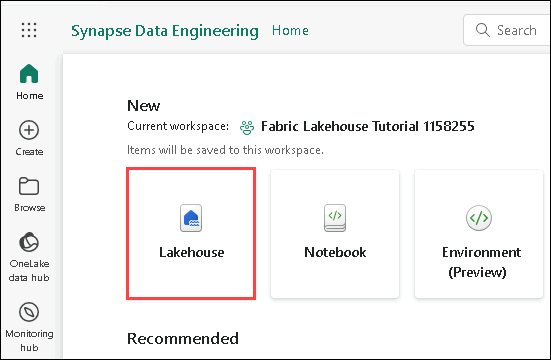
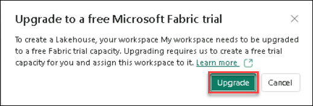
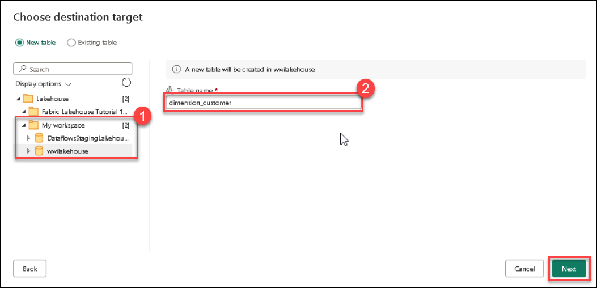
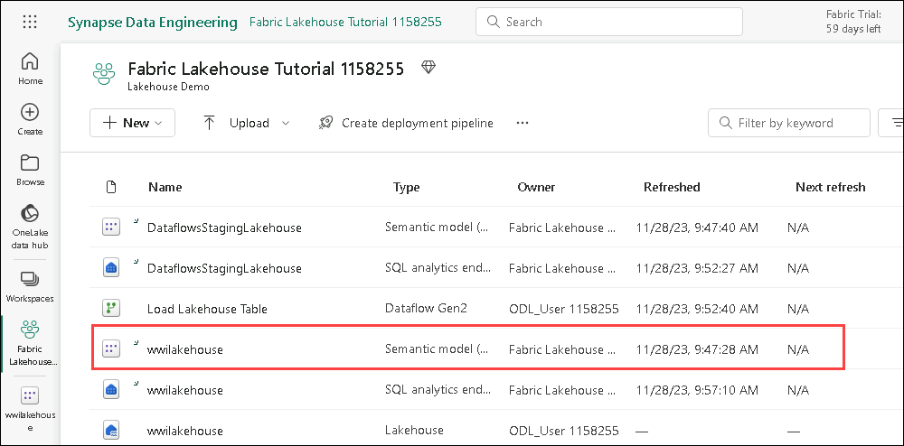
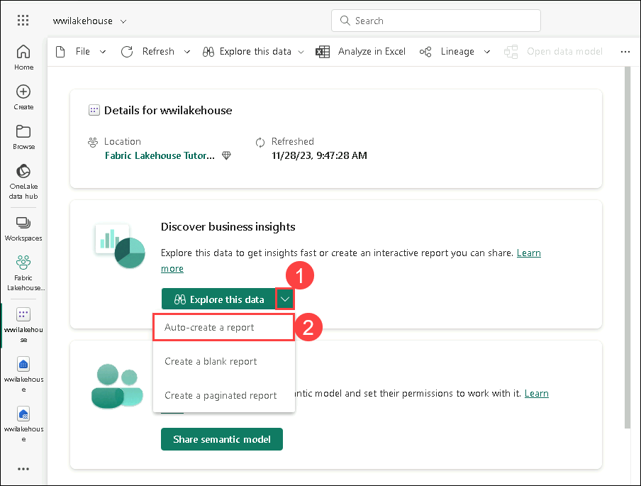
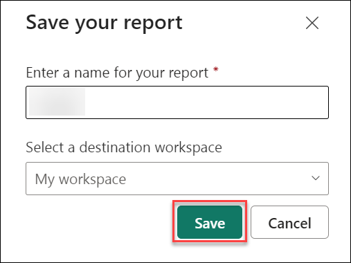

### Exercise 2: Build a lakehouse

#### Task 2.1: Activate SharePoint Online

1. To activate SharePoint Online, copy the **Office homepage link** and open this link inside the VM in a new tab.

   ```
   https://office.com
   ```

2. Click on **Sign in (1)**.

   

3. If you see the prompt **Action Required**, click on **Ask Later (1)**.

   

4. You have now successfully signed into **Office homepage** and activated **SharePoint Online**.

   

   >**Note:** This will be required for a particular task in the lab.

5. You can now close this tab and proceed to the next task.

----

#### Task 2.2: Create a lakehouse

1. From the newly created Power BI workspace, make use of the **Experience switches (1)** located at the bottom left, and select **Data Engineering (2)**.

   

2. In the **Data Engineering** tab, select **Lakehouse (1)** to create a lakehouse.

   

3. Click on **Upgrade** tab.

    

4. In the **New lakehouse** dialog box, enter **wwilakehouse (1)** in the **Name** field, and click on **Create (2)** to create and open the new lakehouse.

   

----

#### Task 2.3: Ingest sample data

1. In the **Lakehouse Explorer**, you see options to load data into Lakehouse. Select **New Dataflow Gen2 (1)**.

   

2. On the new dataflow pane, select **Import from a Text/CSV file (1)**.

   

3. On the **Connect to data source (1)** pane, select the **Upload file (Preview) (2)** radio button, and then click on **Browse (3)**.

   

4. In the Open window, navigate to the **C:\FabricFiles (1)** folder, select the **dimension_customer.csv (2)** file, and click on **Open (3)**.

   

5. After the file is uploaded, select **Next (1)**.

   

   >**Note:** The **Preview file data** page might require a few minutes to load.

6. From the **Preview file data** page, preview the data and select **Create (1)** to proceed and return back to the dataflow canvas.
   
   

7. It will open up a **Power Query** editor. In the **Query settings (1)** pane, verify whether **dimension_customer (2)** is reflected under the **Name** field. 

   

8. Now, we will be removing the pre-configured **Data destination** and configuring it manually, click on the **X (1)** next to the Lakehouse icon under **Data destination**.

   

9. It will open up a prompt which will ask you to  confirm to **Remove data destination**, and click on **OK (1)**.

   
   
10. Now, in the **Power Query** editor, click on **Add data destination (1)**, and select **Lakehouse (2)**.

    

11. In the **Connect to data destination** pane, confirm the **Connection (1)**, and click on **Next (2)**.

    

12. In the **Choose destination target** pane, confirm the name of the table to be **dimension_customer (1)**. Now, expand your workspace select **wwilakehouse (1)**, and click on **Next (3)**.

     

14. In the **Choose destination settings**, select **Replace (1)** as Update method. Select **Save Settings (2)** to return to the dataflow canvas.

    

15. From the dataflow canvas, select **Publish (1)** at the bottom right of the screen.

    

16. A spinning circle next to the dataflow's name indicates publishing is in progress in the item view.

    

17. Once publishing is complete, click on the **...(1)** and select **Properties (2)**.

    

18. Rename the dataflow to **Load Lakehouse Table (1)** and select **Save (2)**.

    -T2.3-S17.png)

19. Select the **Refresh now (1)** option next to the data flow name to refresh the data flow. It runs the dataflow and moves data from the source file to the lakehouse table.

    

20.  Once the dataflow is refreshed, select your lakehouse from the **Fabric workspace**.

     

21. Now, you can view the **dimension_customer (1)** delta table. Select the table to preview its data.

     >**Note**: If you are unable to view _dimension_customer_ delta table, please refresh the page.

     

23. You can also use the SQL analytics endpoint of the lakehouse to query the data with SQL statements. Select **SQL endpoint (1)** from the Lakehouse drop-down menu at the top right of the screen.

      

24. Select **New SQL query (1)** to write your SQL statements.

    

25. Input the following SQL query which aggregates the row count based on the BuyingGroup column of the **dimension_customer** table.

    ```
    SELECT BuyingGroup, Count(*) AS Total
    FROM dimension_customer
    GROUP BY BuyingGroup
    ```

26. Click on **Run (1)** to run the query, and view the results.

    

----

#### Task 2.4: Build a report

1. From the workspace, select the **wwilakehouse Semantic model (1)**. This dataset is automatically created and has the same name as the lakehouse.

   

2. From the dataset pane, you can view all the tables. You have options to create reports either from scratch, paginated reports or let Power BI automatically create a report based on your data. For this lab, select **Explore this data (1)** and click on **Auto-create a report (2)**.

   

3. Since the table is a dimension and there are no measures in it, Power BI creates a measure for the row count aggregates it across different columns, and creates different charts as shown in the following image. You can save this report for the future by selecting **Save (1)** from the top ribbon.

   

4. Name the Report and click on **save**.

   

Congratulations! You have successfully learned to create a lakehouse, ingest sample data and build a report.

----

*Continue to page 10 ...*
